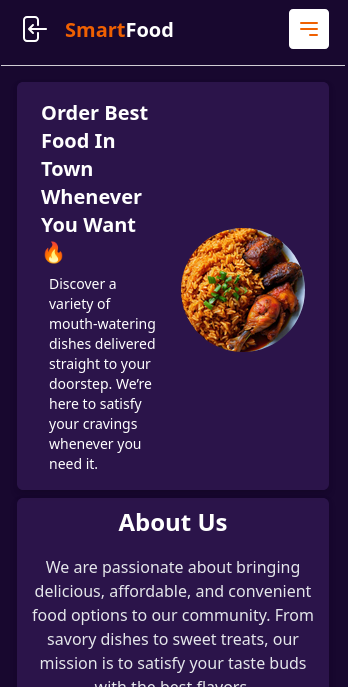
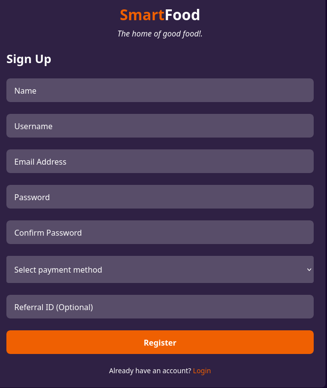
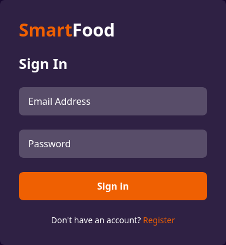

# SmartFood Frontend

Welcome to **SmartFood**, a modern frontend project built with Vue 3 and Vite. This application is designed to provide an intuitive, fast, and scalable solution for food management, meal planning, and nutritional tracking.

---

## 🚀 Why SmartFood?

SmartFood aims to simplify meal planning and food management for individuals and families. With a sleek user interface, dynamic features, and lightning-fast performance, SmartFood helps users:

- Track nutritional intake
- Plan weekly meals
- Discover healthy recipes
- Manage shopping lists
- Achieve wellness goals

---

## 🛠️ Technologies Used

- [Vue 3](https://vuejs.org/) — Progressive JavaScript framework for building user interfaces
- [Vite](https://vitejs.dev/) — Next-generation frontend tooling for fast development
- [JavaScript (ES6+)](https://developer.mozilla.org/en-US/docs/Web/JavaScript)
- [CSS3](https://developer.mozilla.org/en-US/docs/Web/CSS)
- [VSCode + Volar](https://marketplace.visualstudio.com/items?itemName=Vue.volar) (recommended for development)

---

## ✨ Key Features

- 📊 Real-time nutrition tracking
- 🥗 Personalized meal plans
- 🛒 Smart shopping list generator
- 🔍 Recipe discovery and filtering
- 👨‍👩‍👧‍👦 Multi-user support
- ⚡ Lightning-fast performance and hot-reloading during development

---

## 📸 Screenshots

### Welcome Page


### Register Page


### Login Page


### Contact Page


---

## 🚀 Live Demo

Experience SmartFood live: [SmartFood Demo on Vercel](https://smart-food-ochre.vercel.app/)

---

## 🏗️ Getting Started

### Project Setup

```sh
npm install
```

### Development (Compile & Hot-Reload)

```sh
npm run dev
```

### Production Build (Compile & Minify)

```sh
npm run build
```

**Customize configuration:**  
See [Vite Configuration Reference](https://vite.dev/config/).

---

## 👤 About the Developer

Hi! I'm [Codegrammer999](https://github.com/Codegrammer999), a passionate fullstack developer with a keen interest in building scalable and delightful web applications.  
Feel free to connect with me on [Whatsapp](https://wa.me/2349061458909) or reach out by [email](mailto:shyyguyy501@gmail.com).

---

## 📬 Contact

For questions, feedback, or collaboration opportunities, please [open an issue](https://github.com/Codegrammer999/SmartFood/issues) or contact me directly!

---

> _SmartFood: Eat smart, live well._

# Frontend

This template should help get you started developing with Vue 3 in Vite.

## Recommended IDE Setup

[VSCode](https://code.visualstudio.com/) + [Volar](https://marketplace.visualstudio.com/items?itemName=Vue.volar) (and disable Vetur).

## Customize configuration

See [Vite Configuration Reference](https://vite.dev/config/).

## Project Setup

```sh
npm install
```

### Compile and Hot-Reload for Development

```sh
npm run dev
```

### Compile and Minify for Production

```sh
npm run build
```
